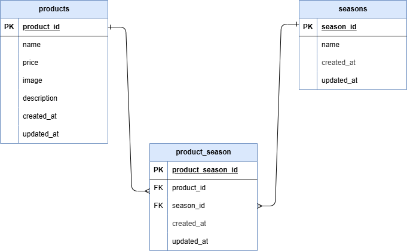

# 確認テスト２_もぎたて：confirmation-test2

## 前提条件
- Gitがインストールされている
- GitHubが使用できる状態
    - SSH接続が設定済みであること
- Docker & Docker Composeを使用できる状態

## 環境構築

**Dockerビルド**
1. git clone git@github.com:ai2525desu/confirmation-test2.git
2. Docker Desktopを立ち上げる
3. docker compose up -d --build

**Laravel環境構築**
1. docker compose exec php bash
2. composer install
3. 「.env example」ファイルを「.env」ファイルに命名変更。または、新しく「.env」ファイルを作成する。
4. 「.env」ファイルの該当箇所に下記の環境変数を追加
```
DB_CONNECTION=mysql
DB_HOST=mysql
DB_PORT=3306
DB_DATABASE=laravel_db
DB_USERNAME=laravel_user
DB_PASSWORD=laravel_pass
```
5. アプリケーションキーの作成
 ```php artisan key:generate```
6. src/storage/app/publicディレクトリ下に保存してある画像を使用のために、シンボリックリンク作成
 ```php artisan storage:link```
7. テーブルデータ反映のため、マイグレーションの実行
 ```php artisan migrate```
8. ダミーデータの反映のため、シーディング実行
 ```php artisan db:seed```

**マイグレーションファイル**
* 2025_07_02_005739_create_products_table.php
* 2025_07_02_005814_create_seasons_table.php
* 2025_07_02_005828_create_product_season_table.php

**シーダーファイル**
* ProductsTableSeeder.php
* SeasonsTableSeeder.php

## 使用環境
- Windows 11 Home
- Ubuntu 24.04.1 LTS
- VSCode 1.101.2
- Docker Desktop Version 28.2.2
- Laravel Framework 8.83.29
- PHP 7.4.9
- nginx:1.21.1
- mysql:8.0.26

## 権限エラー対策(Windows)
* ホストとコンテナ間のファイル権限不一致によるエラーを防ぐため、docker/php/Dockerfileにて独自ユーザー('ai2525desu')を作成し、root権限以外でLaravelを実行している
- Dockerfile一部抜粋
    'RUN useradd -m ai2525desu'
* docker-compose.ymlにてphpの箇所に下記記載を付け加えることでユーザーIDを指定している
- 一部抜粋
    ```
    php:
        build: ./docker/php
        user: "1000:1000"
        volumes:
        - ./src:/var/www/
    ```


## ER図


## URL
* phpmyadmin：http://localhost:8080
* 商品一覧画面：http://localhost/products
* 商品登録画面：http://localhost/products/register
